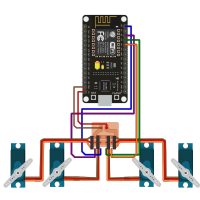

Antes de fazer a montagem da eletrônica e fixar tudo no corpo do Robozito nós recomendamos a montagem somente da eletrônica em separado para que possamos testar os motores, cabos e placas em uma posição em que seja fácil fazer os testes caso sejam necessários.

**Cuidado com seu Servos 9g, as engrenagens dos motores mais baratos costumam ser de plástico e espanam fácilmente caso fiquem travados ou exerçam muita força. Nunca tente força-los em uma posição enquanto energizados**

{: .center width=500px}

 Após a montagem eletrônica, faça a [programação da placa](Doc_Robozito/programacao/configArduinoIDE/) e veja se os motores se movimentam quando ela é ligar. Depois acesse a rede da placa para testar os controles de cada motor.
