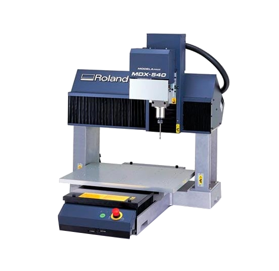
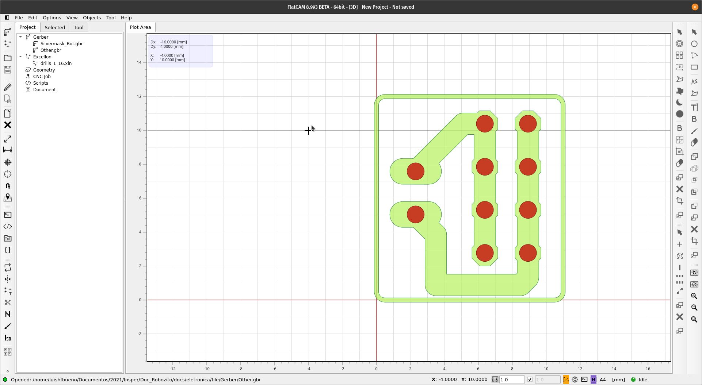

{: .center}
  Para a usingem da placa de circuito utilizamos uma fresadora de precisão, no nosso caso uma Roland modelo MDX540, como matéria prima uma placa de fenolite de uma face, [fresa trapezoidal de 30º](https://www.codigog.com.br/item-Fresa_de_Gravacao_Piramidal_30_graus__x_0.1mm_Metal_Duro-162.htm) para as trilhas e [broca de 0,9mm](https://www.codigog.com.br/item-Broca_0.90mm_Metal_Duro_com_Titanio-291.htm) para as furações.

O processo de usinagem remove o cobre da placa de fenolite utilizando a fresas e brocas para remover a conexão entre a malha de cobre, gerando as conexões do circuito desejado.

<iframe width="560" height="315" src="https://www.youtube.com/embed/cCm-UL-dCEc" title="YouTube video player" frameborder="0" allow="accelerometer; autoplay; clipboard-write; encrypted-media; gyroscope; picture-in-picture" allowfullscreen></iframe>

Abaixo deixo os arquivos **NC** para que você possa usinar suas placas. *Estes arquivos geram 36 placas (que cabem em um fenolite 100x100mm)*
??? info "Arquivos CNC"
    [Furação com broca 0,9mm](file/furos09.nc)
    
    [Usinagem das trilhas](file/trilhas.nc) 
    
    [Corte do Contorno da Placa](file/corteContorno.nc) 
    
  Caso esteja fazendo um projeto novo de placa precisamos exportar os gerbers da sua placa pelo Eagle para usarmos em um software de CAM que gerará os arquivos necessários para sua fresadora.

  *Caso vá mandar fabricar a sua placa externamente, serão pedidos os Gerbers da placa para fabricação*
  
??? tip "Tutorial Exportação de Gerbers"
    [Exportação Gerbers](https://youtu.be/Sa1pzXn8-Es?t=377) 

Após a Exportação iremos utilizar o [FlatCAM](http://flatcam.org/download), software opensource de edição e criação de Códigos G para usinagem em fresadoras CNC, para gerar nossos arquivos para a Fresadora.

{: .center width=900px}
Caso queira só gerar um arquivo com menos placas seguem os gerbers originais abaixo, assim como um tutorial do FlatCAM.

??? info "Gerbers"
    [Furação](file/Gerber/drills_1_16.xln)

    [Trilhas](file/Gerber/Silvermask_Bot.gbr)

    [Corte](file/Gerber/Other.gbr)
    
!!! tip "Tutorial FlatCAM"
    <iframe width="560" height="315" src="https://www.youtube.com/embed/--Cb11heuHc" title="YouTube video player" frameborder="0" allow="accelerometer; autoplay; clipboard-write; encrypted-media; gyroscope; picture-in-picture" allowfullscreen></iframe>
