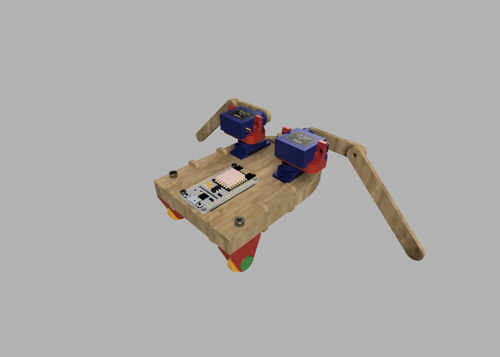

# Robozito 2020

O robozito é um projeto que foi criado pelo aluno Wesley Gabriel em conjunto com os técnicos do Insper Fablab para uma atividade da Roadsec 2019 e agora é utilizado como atividade complementar para os alunos de 1o semestre na disciplina de Natureza do Design.

{: align=left  style="height:400px"}

O robozito apresenta a maioria das suas peças fabricados com máquinas disponíveis em qualquer Fablab, como:

 - Laser: 
    - Corpo
    - Braços
  
 - Impressão 3D:
    - Rodas
    - Suporte dos motores

 - Fresadora de precisão:
    - Placa para conexão com ESP8266
 
 
{: align=right  style="height:400px"}

Seu controle é feito por um ESP8266, que gera uma rede wifi e uma página Web para que os alunos possam conectar e controlalo em conjunto. 
